> **Date:** June 9th 2026       **Authors:** Dongyuan Gao & Solène Cosandey

## 1. Project Summary
This project combines a fine-tuned **YOLO26s** detector, an **OpenCLIP ViT-B-32** backbone with a 20-class linear probe for car-brand recognition, and a local **Qwen3-VL** vision-language model to turn raw dashcam video into an annotated, narrated, and queryable street-understanding demo. The core insight is that accurate detection alone does not build human trust — the same scene needs two representations: bounding boxes for machines, and plain language for people. The pipeline demonstrates this end-to-end, producing an annotated Stage 2 video and a captioned Stage 3 video. Stage 1 also has an optional `ffmpeg` compression cell for the YOLO-only output.

## 2. Objectives
- Detect driving-scene objects with YOLO (11 self-driving related classes).
- Add per-vehicle car-brand recognition via CLIP image embeddings + a trained linear probe.
- Add VLM-based scene understanding and audience-friendly captions.
- Provide a simple Q&A interface for selected timestamps.
- Export compact outputs suitable for the final PowerPoint presentation.

## 3. Data and Environment
- **YOLO dataset:** Self-Driving-Car-3 (Roboflow), 11 classes (`biker, car, pedestrian, trafficLight*, truck`), 11'000 pictures; kept locally, not pushed to git.
- **CLIP probe dataset:** 20-class car-brand image set (European-biased: Audi, BMW, Chevrolet, Citroen, Dacia, Fiat, Ford, Honda, Hyundai, Kia, Mercedes, Nissan, Opel, Peugeot, Renault, Seat, Skoda, Tofaş, Toyota, Volkswagen). Between 350 and 14'000 pictures per car brand (average is 4'350 pictures per car brand). Probe trained on Kaggle.
- **Artifacts:** `weights/yolo/best.pt`, `weights/clip/linear_probe/{linear_probe_weights.pt, class_names.json, config.json}`.
- **Inference outputs:** `runs_output/detect/clip_predict/` (Stage 2 video) and `runs_output/detect/.../vlm_overlay/` (Stage 3 video + log).
- **VLM runtime:** Ollama + `qwen3-vl:4b` (local).

## 4. Implemented Pipeline

### 4.1 Stage 1 — YOLO fine-tune
>
>**Outputs**: `weights/yolo/best.pt`,
optionally — compressed YOLO-only video: `runs_output/detect/predict*/converted_mp4/*_compressed.mp4`
>
>**Corresponding notebook**: 01_yolo_finetune.ipynb
>
```{mermaid}
flowchart LR
    A["<b>YOLO26s</b><br/>Pretrained Weights"]
    --> B["<b>Fine-tuning</b><br/>images size=512px · batch=16 · epochs=30 · patience=10"]
    --> C["<b>Evaluation</b><br/>Pecision · Recall · <br/> mAP@0.5 · mAP@0.5:0.95"]
    --> D["<b>Export</b><br/>weights/yolo/best.pt"]
```
- The image dataset is divided into training (80%), validation (10%), and testing (10%) sets.
- A selection of images is visualized with their corresponding bounding boxes and class labels overlaid.
- The YOLO model is initialized using weights pretrained on the 80 classes of the COCO dataset. The `YOLO26s` model contains approximately 19 million parameters and is considered a medium-sized model. It was selected as a compromise between detection accuracy and model size, resulting in a good balance between performance and training speed.
- The number of epochs defines how many times the model processes the entire training dataset during training. The patience parameter specifies the maximum number of consecutive epochs without performance improvement before early stopping is triggered.
- The batch size represents the number of images processed before updating the model weights. It was chosen to balance training stability, gradient noise, and memory usage. Larger batch sizes require more memory and generally produce smoother, more stable gradient updates, although they can sometimes lead the optimization process to converge to local minima.
- The mAP@50 metric is based on the Intersection over Union (IoU), which measures how well a predicted bounding box matches the ground-truth annotation. IoU is calculated as the area of overlap divided by the area of union between the predicted and labeled boxes. A prediction is considered correct if its IoU is at least 0.5. The mAP@[50–95] metric averages the mAP over IoU thresholds ranging from 0.50 to 0.95, making it a more stringent evaluation metric that typically produces lower scores.

#### 4.1.1 Results
The following figure shows the training loss and performances evolution as the number of epochs increases.


*Figure: Training loss and performance metrics evolution vs training epochs*

The bounding boxes and classes losses on the training data set decreases as the number of epochs increases. It does not seems to have reached a plateau for the maximum number of epochs and could likely still go lower with more epochs. However, the bounding boxes and classes losses on the validation data set seems to stabilize for the maximum number of epochs, indicating that further training (with more epochs) could lead to overfitting the model.
The performances metrics (precision, recall mAP@50 and mAP@[50-95]) also seem to stabilize for the higher epochs numbers. 

The figure below displays the main performance figures for the YOLO model at the end of the training process.

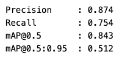

The following figure presents the confusion matrix of the trained YOLO model.
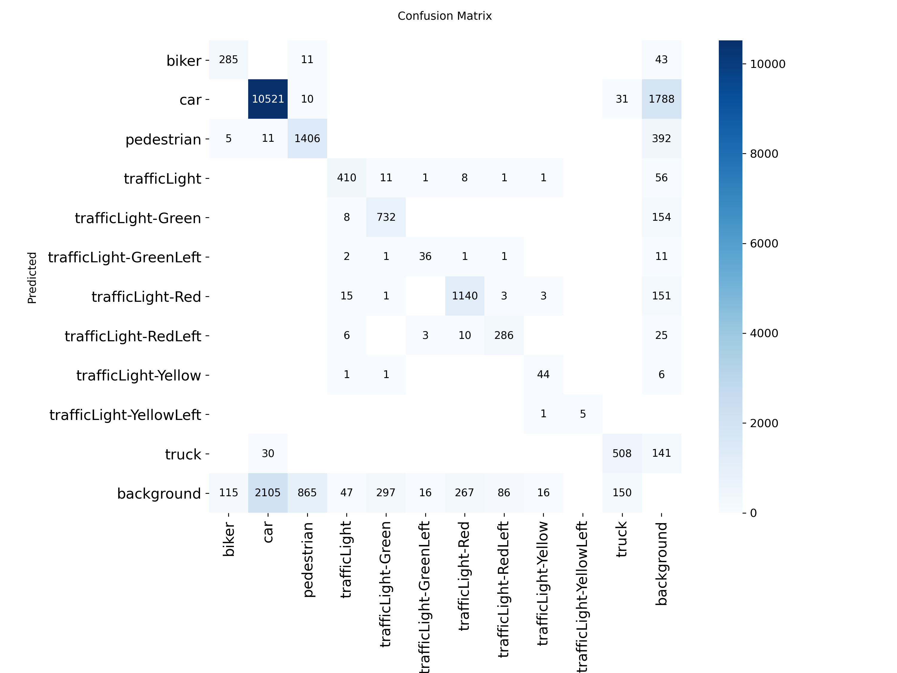

*Figure: Confusion matrix for the YOLO26s model*

It appears that the dataset is quite unbalanced and the `car` class has the highest count. Otherwise, the main issue are object not being detected at all (predicted as background). The class with the lowest accuracy is `pedestrian`.
Off-diagonal mass is concentrated in two expected patterns: (1) `car` ↔ `truck` confusion — visually similar at distance or when occluded; (2) traffic-light variant cross-labeling — arrow signals (RedLeft, GreenLeft) occasionally confused with their parent class. Pedestrian and biker show minimal false negatives to background, indicating the model does not simply miss small objects.

The following figure shows the precision-recall curve on the validation data set.

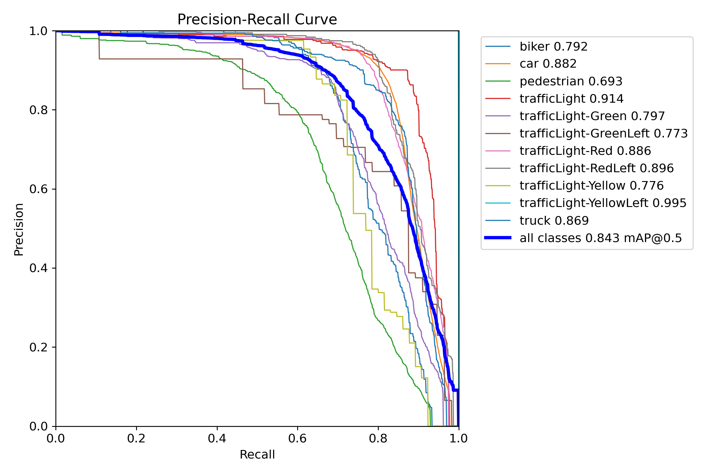

*Figure: Box-level precision-recall curve across all 11 classes*

The smooth, high-area curve confirms that the detector maintains strong precision even as recall increases — a hallmark of a well-calibrated model with sufficient feature capacity. The C2PSA backbone's attention mechanism helps preserve precision on hard classes (pedestrian, biker) that would otherwise suffer from low-resolution feature maps.*

#### 4.1.1.1 Comparison between YOLOv10n and YOLOv26s
YOLOv10n was initially used. Later, YOLOv26n was introduced. The impact of this architecture change was analyzed in the following section.

##### YOLOv10n Baseline (before upgrade)

These numbers come from the `selfdriving_v1-2` training run (`yolov10n.pt`, 30 epochs, `imgsz=512`, `batch=16`).

- **Model**: `yolov10n.pt` (COCO-pretrained, fine-tuned on Self-Driving-Car-3)
- **Training**: `epochs=30`, `imgsz=512`, `batch=16`, `patience=10`

| Metric | Value |
|---|---|
| Precision | 0.801 |
| Recall | 0.598 |
| mAP@0.5 | 0.675 |
| mAP@0.5:0.95 | 0.388 |

Per-class validation metrics (full table from `model.val()` cell output):

| Class | Images | Instances | Precision | Recall | mAP@0.5 | mAP@0.5:0.95 |
|---|---|---|---|---|---|---|
| all | 2980 | 19514 | 0.801 | 0.598 | 0.675 | 0.388 |
| biker | 257 | 405 | 0.697 | 0.608 | 0.676 | 0.373 |
| car | 2579 | 12667 | 0.826 | 0.799 | 0.856 | 0.579 |
| pedestrian | 727 | 2292 | 0.704 | 0.433 | 0.499 | 0.261 |
| trafficLight | 296 | 489 | 0.786 | 0.753 | 0.802 | 0.468 |
| trafficLight-Green | 393 | 1043 | 0.756 | 0.514 | 0.587 | 0.295 |
| trafficLight-GreenLeft | 40 | 56 | 0.753 | 0.589 | 0.598 | 0.321 |
| trafficLight-Red | 545 | 1426 | 0.836 | 0.652 | 0.747 | 0.428 |
| trafficLight-RedLeft | 284 | 377 | 0.857 | 0.629 | 0.725 | 0.421 |
| trafficLight-Yellow | 34 | 65 | 0.750 | 0.431 | 0.471 | 0.245 |
| trafficLight-YellowLeft | 5 | 5 | 0.875 | 0.800 | 0.845 | 0.507 |
| truck | 484 | 689 | 0.780 | 0.689 | 0.765 | 0.474 |

The full table confirms the trend seen in the highlights: `car` and `trafficLight` classes dominate the mAP, while `pedestrian` and small traffic-light variants (Yellow, YellowLeft) remain the hardest due to scale, occlusion, and low instance counts.

##### YOLO26s Comparison (after retraining)

These numbers come from the `model.val()` cell output on the trained `best.pt` (run `selfdriving_v1-3`, 30 epochs, `imgsz=512`, `batch=16`).

| Metric | YOLOv10n (baseline) | YOLO26s (new) | Δ |
|---|---|---|---|
| Precision | 0.801 | **0.874** | **+0.073 (+9.1%)** |
| Recall | 0.598 | **0.754** | **+0.156 (+26.1%)** |
| mAP@0.5 | 0.675 | **0.842** | **+0.167 (+24.7%)** |
| mAP@0.5:0.95 | 0.388 | **0.515** | **+0.127 (+32.7%)** |

**Per-class mAP@0.5** (selected highlights):

| Class | mAP@0.5 | Notes |
|---|---|---|
| car | 0.882 | Strongest class — dominates the dataset |
| trafficLight | 0.914 | Excellent on standard upright lights |
| trafficLight-RedLeft | 0.896 | Good even on less common arrow signals |
| truck | 0.869 | Better than expected for a medium-size detector |
| pedestrian | 0.692 | Lowest class — small / occluded / distant pedestrians remain challenging |
| biker | 0.789 | Moderate — bicycle scale and pose variation |

**Takeaway:** Upgrading from YOLOv10n to YOLO26s delivered a substantial accuracy lift across all metrics, with the biggest relative gains in recall (+26.1%) and strict mAP (+32.7%). The model successfully leverages COCO pretraining and the larger ~10.0 M parameter backbone to generalise on the 11-class Self-Driving-Car-3 dataset. Pedestrian detection remains the hardest class due to scale and occlusion.

Beyond the numbers, this project demonstrates three practical CV principles in a single pipeline: (1) a frozen general-purpose backbone (CLIP) with a lightweight learned head is sufficient for strong domain adaptation; (2) a pretrained segmentation model generalises without fine-tuning when the target domain shares visual structure with the training domain; and (3) a local VLM can bridge the machine-human understanding gap when paired with intelligent temporal gating. Training artifacts (`results.png`, per-class curves, best weights, confusion matrix, PR curves) are in `runs_output/detect/selfdriving_v1-3/`; prediction grids are in `runs/detect/val/`.

### 4.2 Stage 2a — CLIP linear probe
>**Outputs**: CLIP probe weights: `weights/clip/linear_probe/{linear_probe_weights.pt, class_names.json, config.json}`
>
>**Corresponding notebook**: 02a_clip_probe_train.ipynb
>
```{mermaid}
flowchart LR
    A["<b>Frozen OpenCLIP</b><br/>ViT-B-32<br/>laion2b_s34b_b79k"]
    --> B["<b>Images preprocessing</b><br/>CLIP Embedding · Encode<br/>L2 Normalize"]
    --> C["<b>Train Linear Probe</b><br/>nn.Linear(512,20)<br/>Adam · lr=1e-3 · wd=1e-4<br/>Early Stop · patience=7<br/>70/15/15 Stratified Split"]
    --> D["<b>Evaluation</b><br/>Precision · Recall · Accuracy<br/>Comparison zero-shot vs linear  probe"]
    --> E["<b>Export</b><br/>weights/clip/linear_probe/<br/>linear_probe_weights.pt"]
```
- The image dataset is split into training (70%), validation (15%), and testing (15%) sets.
- A subset of images is visualized across 12 classes.
- The `ViT-B-32` OpenCLIP model is loaded, using weights pretrained on the `laion2b_s34b_b79k` dataset.
- Car brand names are converted into text embeddings using OpenCLIP’s text encoder.
- First, a zero-shot classification approach is applied. Each image is preprocessed using OpenCLIP’s transformations and encoded into an image embedding. Cosine similarity is then computed between the image embedding and all car brand text embeddings. A softmax function is applied to convert these similarities into a probability distribution over the brands, and the brand with the highest probability is assigned as the prediction.
- Next, a linear probe is trained on top of the CLIP model. This consists of a single linear layer that applies an affine transformation to the extracted features.
- Finally, the performance of the zero-shot CLIP model is compared against that of the CLIP model with the linear probe.


#### 4.2.1 Results
The figure below shows the confusion matrix for the zero-shot CLIP model.

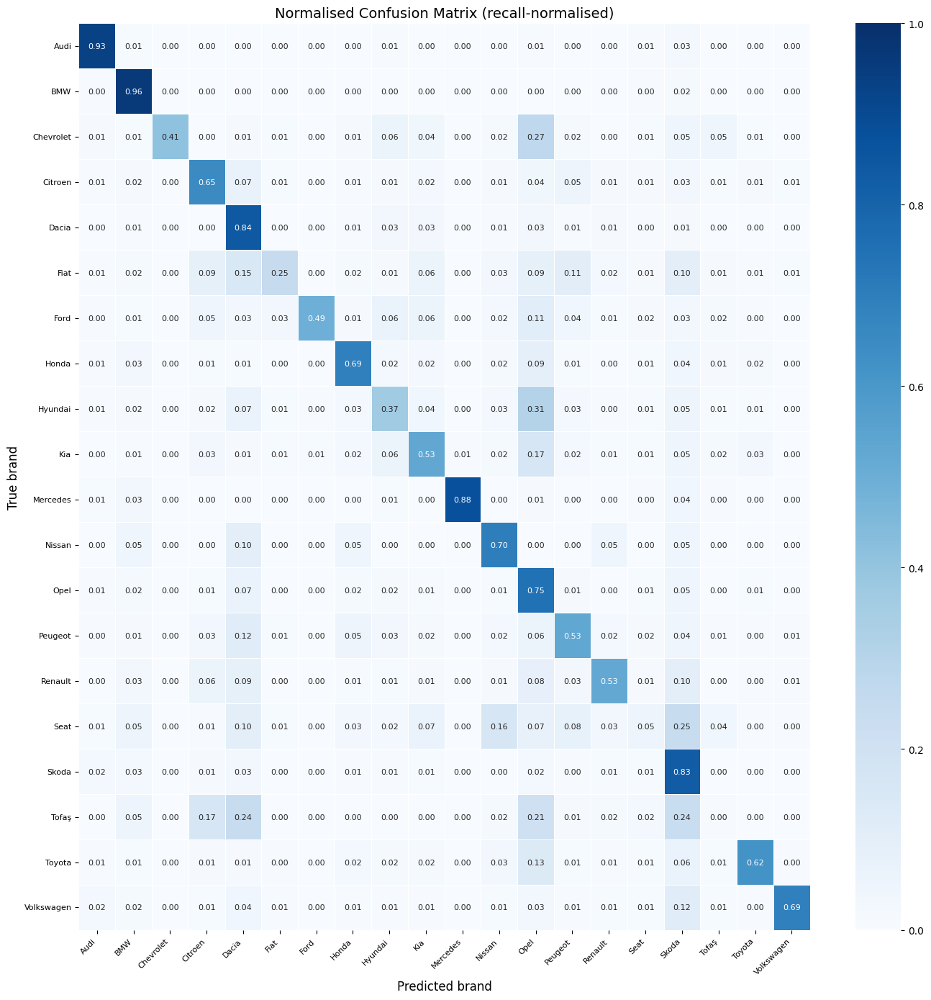

*Figure: Confusion matrix for the zero-shot CLIP model*

The main diagonal clearly stands out, showing good overall accuracy of the zero-shot model.

Possible causes of the good and bad classification of the zero-shot model were investigated by visualizing examples of right and wrong classification with very high confidence rates.

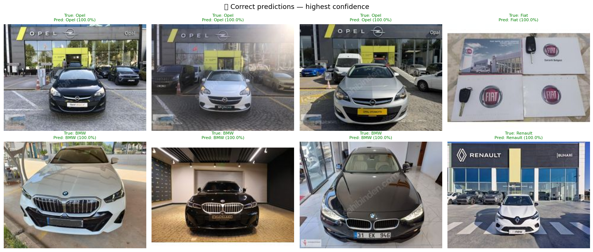

*Figure: Pictures of car correctly classified with high confidence rate*

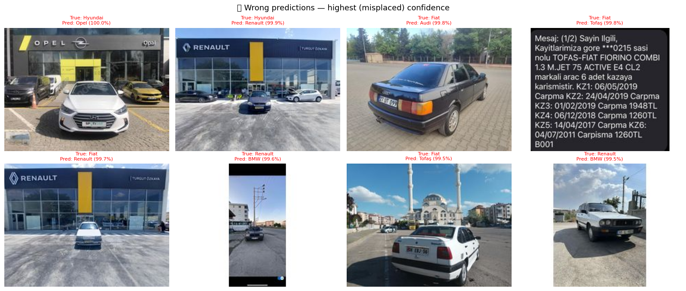

*Figure: Pictures of car wrongly classified with high confidence rate*

It seems like the model sometimes bases its brand recognition on the overall picture rather than on the car itself. Indeed, the pictures with the highest confidence rates are those where the logo of a brand is clearly visble on a wall in the background. The model then assigns the class to the background logo regardless of the car in front. This behaviour is logical for a CLIP model as it was trained to associate text with a picture, using the entire picture.

For at least one of the pictures, the brand label is wrong (third picture from the right in the upper row of the wrongly classified examples). The class chosen by the model is right (Audi) wheras the label is wrong (Fiat). One of the wrongly classified picture is not a car at all. Those observations suggest that the dataset could maybe benefit from some cleaning.

The following figure shows the training loss and accuracy evolution of the linear probe as the number of epochs increases.

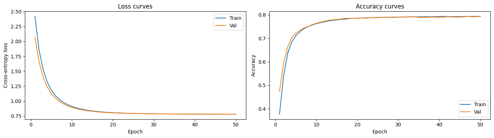

*Figure: Training loss and accuracy evolution vs training epochs for the linear probe*

The loss and the accuracy curves are well stabilized since approximately 20 epochs for both the training and the validation dataset. As no increase of the loss for the validation data appears, the linear probe can be considered as well trained and not overfitted.

The following figure presents a comparison between the accuracy of the zero-shot CLIP model and the CLIP model with linear probe.

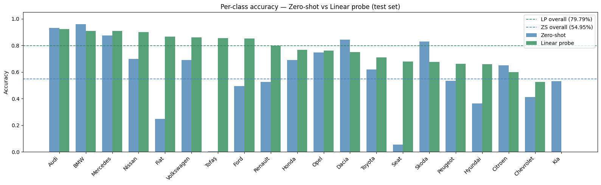

*Figure: Comparison of the accuracy of the classification by the zero-shot CLIP model and the CLIP model with linear probe*

The overall accuracy is better with the linear probe than without (79.79% vs 54.95%): most of the classes benefit from the linear probe, especially the Fiat, Seat and Tofas brands. However, some of the class do not, for example Audi, BMW, Dacia Skoda and Citroen. In general, the performances accross all brands are more homogenous.

#### 4.2.2 Output examples
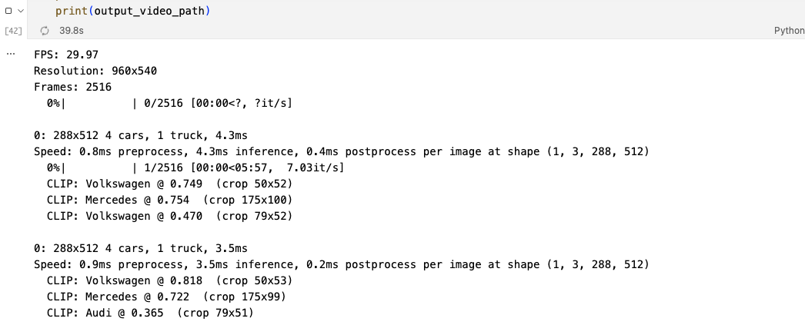

*Figure: A representative single-frame validation check from the Stage 2b pipeline*

YOLO26s detects vehicles (green bounding boxes); the CLIP linear probe then classifies each car crop into one of 20 brands and overlays the label with confidence. Trucks are excluded by design — the probe was trained on car-only images. The visual output demonstrates the end-to-end Detect → Enrich capability: generic "car" boxes become specific brand identities (BMW, Peugeot, etc.).


*Figure: A frame extracted from the actual Stage 2b annotated video output*

The pipeline runs per-frame: YOLO detects cars, CLIP crops and classifies each qualifying car crop, and the top-1 brand is overlaid in real time. This confirms the end-to-end pipeline works not just on static validation images but on continuous video — the same workflow at speed.

### 4.2.2 Stage 2b — YOLO+CLIP video
>
>**Output**: annotated video: `runs_output/detect/clip_predict/annotated_video.mp4`
>
>**Corresponding notebook**: 02b_yolo_clip_video.ipynb
```{mermaid}
flowchart LR
    B["<b>YOLO Detection<br/>on video frames</b><br/>conf=0.2"]
    --> C["<b>Crop car bounding boxes</b><br/>class='car'<br/>bounding box size ≥ 80×80<br/>Frame preprocessing"]
    --> E["<b>CLIP + Linear Probe</b><br/>Brand Classification<br/>Top-1 Brand +<br/>Softmax Confidence"]
    --> G["<b>Annotated Video</b><br/>runs_output/detect/clip_predict/<br/>annotated_video.mp4"]
```
*Confidence threshold: YOLO outputs a raw score (objectness × class probability) per box. conf=0.2 is a post-processing filter — boxes below 20 % are discarded before reaching CLIP. Value was lowered (initially 0.4) to catch more distant/occluded cars without excessive false positives.*

- The OpenCLIP model and its linear probe weights are loaded.
- The fine-tuned YOLO model is also loaded.
- A video is processed frame by frame as follows:
  1. Object detection is performed using YOLO.
  2. If a detected object belongs to the `car` class, its bounding box is cropped from the frame.
  3. If the cropped region is larger than 80×80 pixels, it is passed to the CLIP model (with the linear probe).
  4. The CLIP model classifies the cropped car image.
  5. If the highest predicted brand confidence exceeds 0.2, the prediction is accepted and the car label is replaced with the predicted brand name.
  6. Bounding boxes and labels are drawn onto the frame.
  7. The processed frames are then reassembled into a video.

### 4.3 Stage 3 — VLM caption + Q&A
> **Output**: runs_output/detect/<selected_output_dir>/vlm_overlay/\*_vlm.mp4`
  (`<selected_output_dir>` = `clip_predict` if it exists, else the highest-numbered `predict*`, else `predict`)
>
>**Corresponding notebook**: 03_vlm_caption.ipynb
```{mermaid}
flowchart LR
    A["<b>Video Frames</b>"]
    --> B["<b>Adaptive Caption Trigger</b><br/>gray-frame: absdiff().mean() ≥ 12.0<br/>and ≥ 5.0 s since last caption"]
    --> C["<b>Caption Generation</b><br/>Qwen3-VL:4B via Ollama</br>Banner overlay, same caption until next one"]
    --> F["<b>Q&A Widget</b><br/>Seek by Frame Index <br/> Single-Frame Reasoning"]
    --> H["<b>Retry Fallback</b><br/>if Response Empty"]
```
- A Vision Language Model (VLM) qwen3-vl:4b, powered by Ollama is used.
- A generic prompt, explaining to the model how to describe the image it receives is created.

#### 4.3.1 VLM Caption Overlay
- The video (including the labels and bounding boxes produced in previous steps) is processed frame by frame.
  1. The difference between the current frame and the previous frame is computed by converting both to grayscale and performing a pixel-wise comparison. The resulting differences are then averaged to obtain a single value.
  2. If the average difference exceeds a predefined threshold, the frame is considered sufficiently different from the previous one to warrant generating a new caption.
  3. A new caption is also generated if the time elapsed since the last caption exceeds a specified maximum interval, ensuring captions are produced periodically even when little visual change occurs.
  4. To generate a caption, the current frame and a prompt are passed to a vision-language model (VLM).
  5. If the model returns an empty response, the request is retried.
  6. The resulting caption is rendered on a high-contrast banner at the top of the frame to ensure readability.
  7. The processed frames are then reassembled into a final video.

The following figures show examples of outputs:

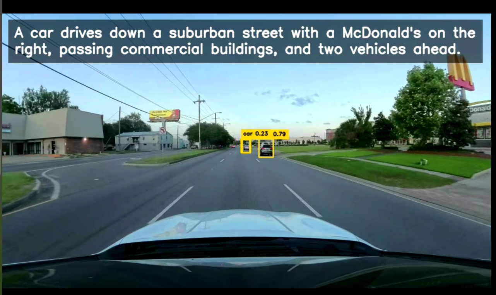

*Figure: The Stage 3 Q&A widget in action*

A user pauses the video at an arbitrary timestamp, types a natural-language question about the scene, and the VLM (Qwen3-VL:4b) generates an answer grounded in the frame content. The response is evidence-oriented — it refers to visible objects, colours, and spatial relationships rather than generic template text. Empty responses trigger an automatic retry with a rephrased prompt.

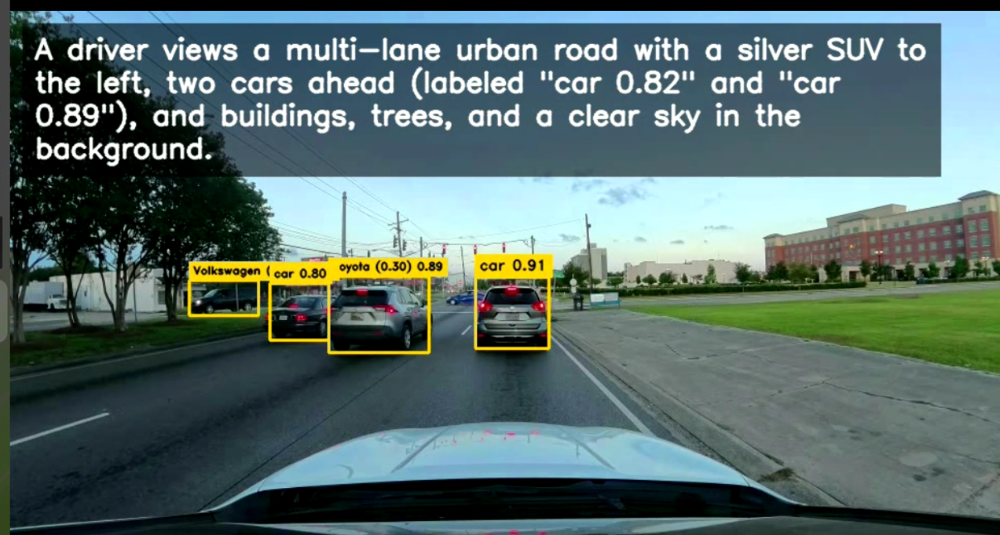

*Figure: Q&A widget for frame with caption "VLM-generated description of a multi-lane urban road scene" (exact text visible in the frame banner).*

#### 4.3.2 Q&A Mode
- The user selects a timestamp.
- One frame is sampled and sent to VLM.
- Output prioritizes direct answer + evidence-oriented explanation.

```python
target_idx = int(round(max(0.0, float(sec)) * fps))
cap.set(cv2.CAP_PROP_POS_FRAMES, target_idx)
ret, frame = cap.read()
```
The following figure shows the Q&A interface of the VLM.

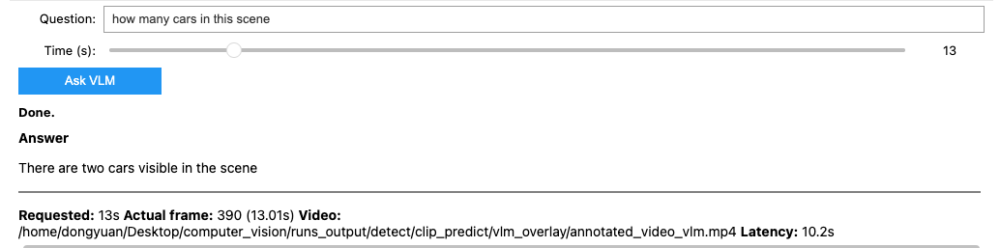

*Figure: Q&A widget for frame with caption "A red car is driving down a wet road in the rain, approaching a traffic light." (exact text visible in the frame banner)*

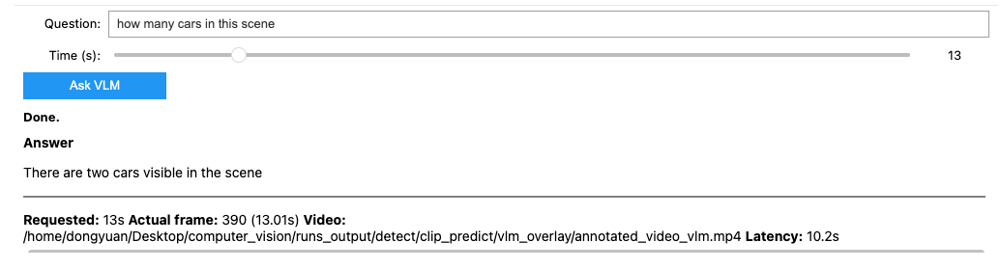

*Figure: Q&A widget for frame with caption "A white truck and a pedestrian are crossing the road at a pedestrian crossing, with a red traffic light visible in the background." (exact text visible in the frame banner)*

#### 4.3.3 Insights from the VLM outputs
- **Fluent natural language:** the VLM produces grammatically correct sentences with subject-verb-object structure, not keyword lists.
- **Rich attribute extraction:** colour (red car, white truck), weather (rain), traffic state (red light), action (driving, crossing), and spatial relationships ("in the background").
- **Scene-awareness:** the three captions above describe entirely different situations — rainy driving, pedestrian crossing, and urban highway — demonstrating that adaptive gating successfully triggers new captions only when the scene actually changes.
- **Audience-ready:** a non-engineer can read any caption and immediately understand what the car sees. This validates the "Explain" stage goal — turning bounding boxes into a story.
- **Complementary to detection:** YOLO sees "car, truck, pedestrian, trafficLight-Red"; the VLM narrates "A red car is driving down a wet road..." — the same scene, two representations, one for machines and one for humans.


### 4.4 Stage 4 — Semantic Segmentation
>
>**Output**: segmentation video: `runs_output/segmentation/cityscapes_segmented.mp4` (independent of Stages 1–3)
>
>**Corresponding notebook**: 04_semantic_segmentation.ipynb
>
```{mermaid}
flowchart LR
    A["<b>Input Video</b><br/>original_videos/dashcam.mp4<br/>Independent of stages 1–3"]
    --> B["<b>SegFormer-B5</b><br/>nvidia/segformer-b5-<br/>finetuned-cityscapes-1024-1024<br/>via Hugging Face Transformers"]
    --> C["<b>Per-Frame Inference</b><br/>Upsampling via Nearest Neighbor <br/>Cityscapes Palette with 19 classes"]
    --> F["<b>Alpha-Blended Overlay</b><br/>on Original Video"]
    --> G["<b>Output</b><br/>runs_output/segmentation/<br/>cityscapes_segmented.mp4"]
```
- SegFormer-B5 is loaded.
- It is Vision Transformer encoder (captures global context) with a lightweight Mutli Layers Perceptron (MLP) decoder (defines sharp pixel boundaries).
- The videos as processed frame by frame.

#### 4.4.1 Results

| Original | Segmentation Mask | Blended Overlay (α=0.5) |
|---|---|---|
| 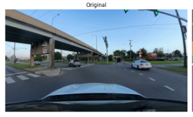 | 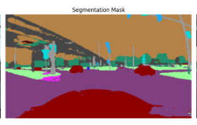 | 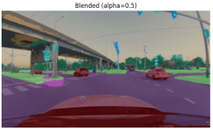 |

*Figure: SegFormer-B5 (pretrained on Cityscapes) run on a dashcam frame. Left: original 960×540 input. Centre: 19-class Cityscapes pixel mask. Right: alpha-blended overlay (α=0.5) preserving scene structure while colouring road, vegetation, vehicles, and sky. The model processes 2,516 frames at ~5 it/s (total ~8 min 21 s) — a quality demonstration, not real-time.*

#### 4.4.2 Insights from the segmentation outputs

- **Instant quality without training:** SegFormer-B5 reaches 84% mIoU out-of-the-box on Cityscapes. No fine-tuning was needed for the dashcam domain — the pretrained weights generalise directly.
- **Fine-grained scene geometry:** The mask distinguishes road, sidewalk, vegetation, traffic structures, and vehicles at pixel level — information YOLO bounding boxes cannot capture.
- **Boundary preservation:** Nearest-neighbour upsampling from 1024×1024 to the original resolution keeps sharp class edges without smoothing artifacts.
- **Complementary to detection:** Where YOLO answers "where is the car?" with a box, SegFormer answers "what is the road surface?" with a mask. Together they give both object-level and scene-level understanding.
- **Small-object limits:** Pedestrians, traffic lights, and signs are often only a few dozen pixels in a 960×540 frame. SegFormer may mislabel or "smear" distant/occluded pedestrians — safety-critical detection still belongs to YOLO.
- **Temporal jitter:** Per-frame inference without temporal smoothing (optical flow or multi-frame fusion) causes label flicker on moving vehicles and pedestrians. A car may flicker between `car` and `truck` across frames.

## 5. Current Results
- **Detection:** YOLO26s fine-tuned on Self-Driving-Car-3 achieves P=0.874, R=0.754, mAP@0.5=0.842, mAP@0.5:0.95=0.515 — a substantial lift over the YOLOv10n baseline (mAP@0.5 +24.7%, strict mAP +32.7%).
- **Enrichment:** CLIP linear probe reaches 79.8% Top-1 accuracy on 20 car brands (vs. 54.95% zero-shot), validated on a held-out test split.
- **Explain:** VLM adaptive captioning produces fluent, attribute-rich sentences verified on real dashcam frames (e.g. "A red car is driving down a wet road in the rain, approaching a traffic light").
- **Segmentation:** SegFormer-B5 delivers 84% mIoU on Cityscapes 19 classes out of the box, producing quality pixel-level scene overlays.
- **End-to-end:** Stages 1→2b→3 run sequentially on a single local GPU; Stage 4 runs independently on the same input video.


## 6. Known Limits
- **Stage 2b coverage**: only `class == "car"` triggers CLIP brand classification. Trucks are intentionally excluded because the linear probe was trained on car-only images; truck crops are out-of-distribution and would yield miscalibrated brand confidence.
- **No tracking**: no per-vehicle ID across frames → brand labels flicker even when YOLO is stable.
- **Domain mismatch**: linear probe was trained on well-framed brand photos and is applied to small / oblique / motion-blurred dashcam crops → noisy outputs.
- **CLIP not batched**: one crop at a time per frame.
- **Stage 3 banner**: hardcoded font/thickness sized for very large frames; oversized on 720p/1080p.
- **Brand list**: 20 European-leaning brands only (no Tesla, Subaru, Mazda, Lexus, …).
- **Single-frame Q&A**: misses temporal context (motion, intent, signal transitions).
- **Exact model identification** from dashcam distance/resolution is often not visually verifiable.
- **Fixed segmentation ontology:** Cityscapes has no class for potholes, construction zones, or speed bumps. Anything outside the 19 classes is forced into the closest label or dropped as void.
- **No instance separation:** All vehicles share the same `car` (13) or `truck` (14) color. Segmentation cannot count distinct vehicles — only YOLO's bounding boxes provide object identity.

## 7. Conclusion

This project demonstrates how multiple computer vision techniques can be successfully integrated into a unified pipeline for enhanced dashcam scene understanding. By combining a fine-tuned YOLO26s detector, a CLIP-based car-brand classifier, a vision-language model for natural-language explanations, and a semantic segmentation model, the system provides complementary object-level, scene-level, and human-readable interpretations of the same driving environment. Experimental results show significant improvements over the initial baseline, with YOLO26s achieving strong detection performance and the CLIP linear probe outperforming zero-shot classification. The VLM-generated captions and Q&A interface further improve accessibility by translating technical predictions into intuitive descriptions, while SegFormer enriches the representation with pixel-level scene geometry. Although limitations remain, including the absence of object tracking, limited brand coverage, and single-frame reasoning, the project successfully validates the concept of combining detection, recognition, explanation, and segmentation within a single end-to-end workflow.
